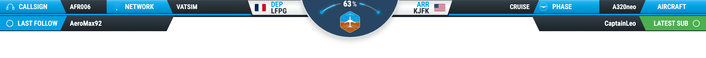

# Stream Inflight Overlay

Overlay de vol pour OBS construit en HTML, JavaScript et SCSS.

## Stack

- Bun
- Vite
- Sass / SCSS
- JavaScript Vanilla

## Installation

```bash
bun install
```

## Développement

```bash
bun run dev
```

Le navigateur s’ouvre automatiquement.

## Build

```bash
bun run build
```

## Preview

```bash
bun run preview
```

Le navigateur s’ouvre automatiquement sur le build de production.

## Structure

```text
index.html
img/
js/
scss/
  _variables.scss
  _base.scss
  _header.scss
  _social.scss
  _airports.scss
  _center.scss
  _animations.scss
  style.scss
```


